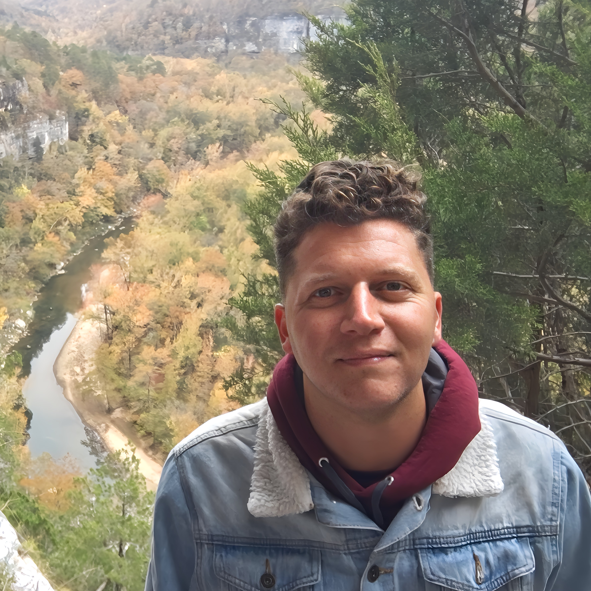

I am an assistant professor of history at the University of Arkansas at Little Rock, where I am also a Gender Studies affiliate faculty member. I teach courses on world history and research methods, as well as seminars on the Haitian Revolution in World History, Modern France through Film, and the Atlantic in Global Perspective.

My research examines race and religion in the eighteenth-century French colonial world. I'm working on a book that examines how gender and family dynamics shaped the politics of whiteness on the Indian Ocean island of Réunion, from its seventeenth-century establishment to the era of the French and Haitian Revolutions. My second project is a history of slavery and resistance on properties held by French Catholic priests and nuns, from Montreal to Mauritius. 

{: width="600"}
