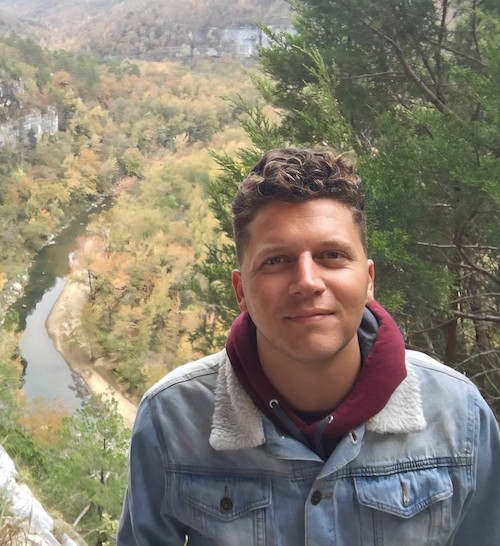

I am a historian specializing in the French colonial world. My current book project explores the politics of race on the Indian Ocean island of Réunion, before and during the era of the French and Haitian Revolutions. My second project examines the role of Catholic orders and congregations as major slaveholders in the French empire, centering the experiences and resistance strategies of those enslaved on Church properties. I teach history at the University of Arkansas at Little Rock, where I am also a Gender Studies affiliate faculty member.

