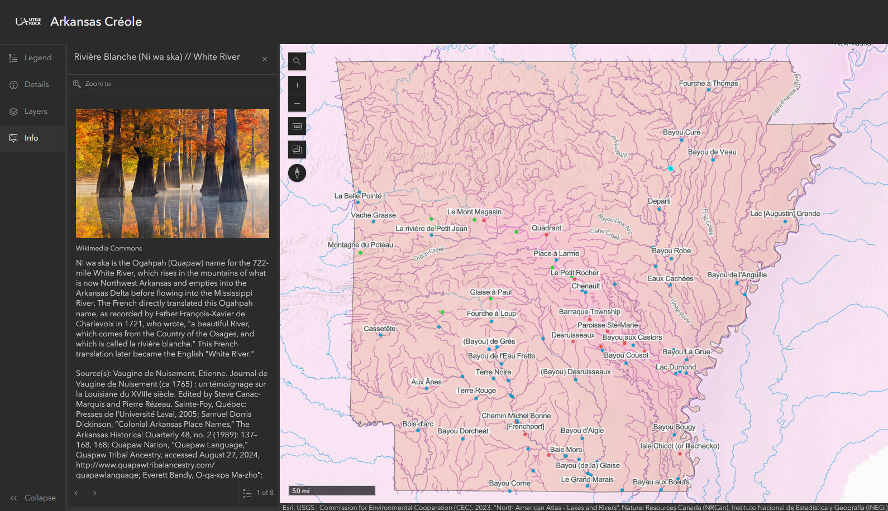
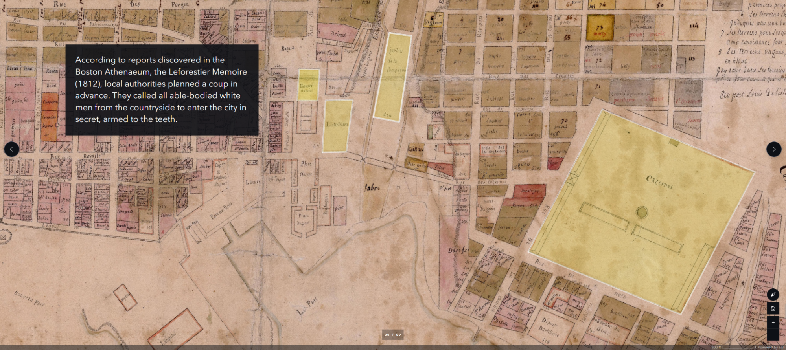
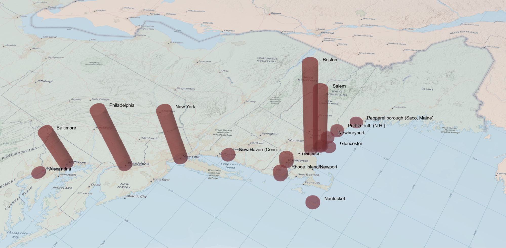
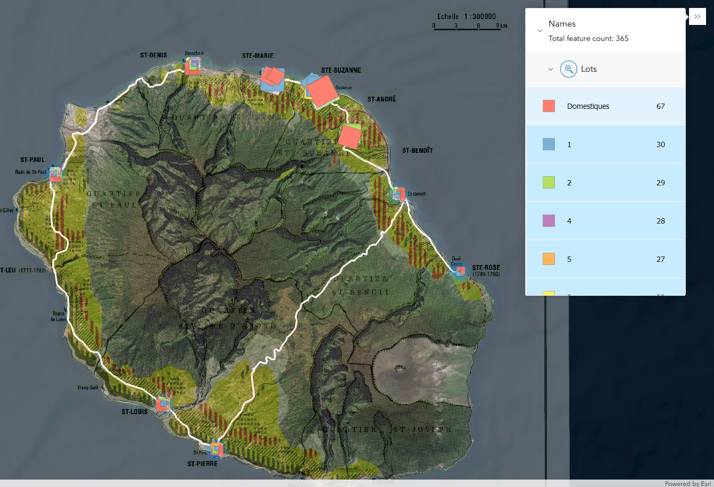
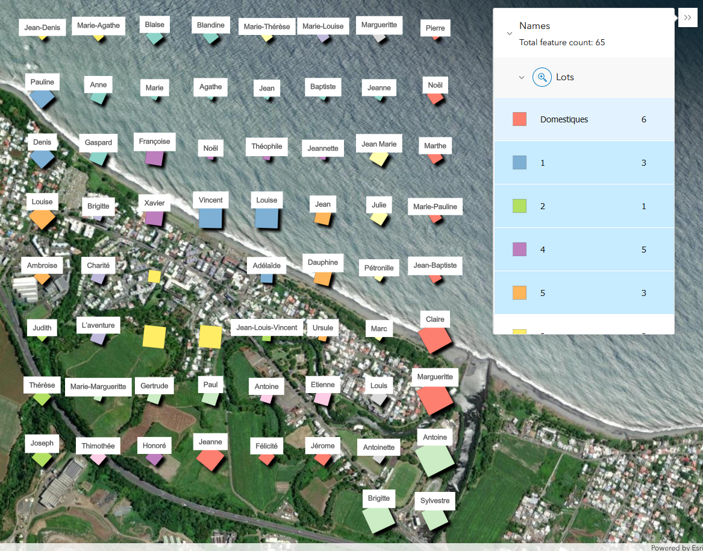
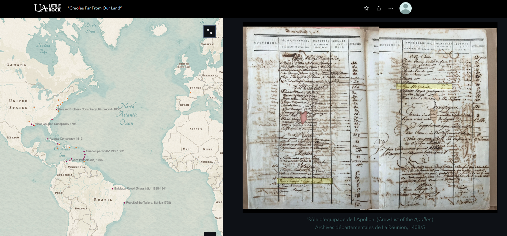

Digital humanities projects-in-progress. I welcome suggestions for improvements or corrections. All projects and their descriptions are featured below.

---

## Arkansas Créole: Recovering a Lost Vernacular Landscape

**Description**  
Map App Companion to "Arkansas Créole." Click the points on the map to reveal the stories behind the place names.  
- **Layers:** Toggle layers via the "Layers" button.  
- **Info:** Click map points for information pop-ups on the left.  
- **Search:** Search the database of historic names, or locate contemporary geographical features using the search function.

*"Arkansas Créole: Recovering a Lost Vernacular Landscape"* is a digital history project that aims to document the contributions of French-speaking people to early Arkansas history and geography. It focuses on the diverse Creole community—composed of people of European, Indigenous, and African descent—that lived alongside the Ogahpah, Osage, and Caddo nations under French, Spanish, and early US dominion. For generations, the "French period" of Arkansas history has been romanticized, whitewashed, and dismissed as inconsequential. Layers of forgetting have erased the people behind the placenames of Arkansas—especially its rivers, bayous, and streams. This map aims to recover their stories and the traces of the world they left behind.

### Explore
- [Map App](https://gislabualr.maps.arcgis.com/apps/instant/sidebar/index.html?appid=274918c16c384b2eae7ead967f951336)  
- [StoryMap Narrative](https://storymaps.arcgis.com/stories/ab8d60a903104d4ba8e2f21e60602b5d)  

---

## "This Unalterable Friendship": New England Merchants in the French Indian Ocean Islands

From 1786 to 1810, the most important point of origin for ships calling at Port Louis, on what was then the French colony of Isle de France (Mauritius), was Boston, with 86 vessels registered. Ships also came from other American ports, including Salem, Newburyport, and Gloucester (Massachusetts); Philadelphia; New York; Baltimore; Providence; New Haven; Nantucket; Portsmouth (N.H.); and Pepperrellborough (today's Saco, Maine).

Why was this distant island port such a draw for Yankee captains? This map-based overview explores the reasons—documenting American merchants in the French islands of the Indian Ocean. By the late 18th century, these islands had become naval and commercial hubs, acting as entrepôts for goods and people between Asia and the Atlantic. The establishment of a free trade zone by France bolstered commerce with the nascent U.S. and offered a way to bypass British export markets. The establishment of a U.S. consulate in Port Louis in 1794 further strengthened ties. This was a two-way relationship: the islands relied on neutral American ships for news and supplies amidst the Revolutionary and Napoleonic Wars.

American merchants also witnessed the ripple effects of the Haitian Revolution and France's 1794 Abolition Decree. In 1796, Mauritius saw a revolt where local elites expelled French commissioners sent to enforce abolition. American merchants, driven by economic interests, supported the coup. This episode highlights the global dimensions of the early United States' Indian Ocean ventures in all their complexity. Research for this project was made possible in part by a Boston Athenaeum Library Fellowship from the American Society of Eighteenth-Century Studies.

### Explore
- [This Unalterable Friendship](https://storymaps.arcgis.com/stories/5a50f7f5c7824506a3256a0e8b496dcf)

---

## Enslaved by the Church, Sold for the Republic

When French revolutionaries seized the assets of the Catholic Church as "national property," the enslaved people living on those properties in the colonies were not spared. This first-of-its-kind interactive atlas documents all sites of slaveholding by Roman Catholic orders and congregations in the French colonial world and beyond. A separate digital narrative feature zooms in on what happened on Réunion Island in 1793, when an agent of the French Republic oversaw the final appraisals or auctions of 365 men, women, and children. Read "between the lines," his detailed reports show glimpses of resistance by enslaved people and their allies as they intervened in the process to keep families united.

### Explore
- [Map App](https://gislabualr.maps.arcgis.com/apps/instant/sidebar/index.html?appid=e89b39a7dadf4f6fb5184b7c694f02ac)  
- [StoryMap Narrative (English)](https://storymaps.arcgis.com/stories/68ea1822adba48acadb2848f40b29048)  
- [StoryMap Narrative (Français)](https://storymaps.arcgis.com/stories/08351cc5814c4d6e9d1672145575b422)  
- [StoryMap Detail ("Les Ventes / 1793")](https://arcg.is/1SKG4u0)

---

## "Creoles Far From Our Land": Mapping the Global Peregrinations of Jean-Baptiste Tabardin

Jean-Baptiste Tabardin was an extraordinary figure. Born to an enslaved mother on the French Indian Ocean colony of Isle de France (Mauritius), he left behind an illustrated manuscript detailing his travels throughout the Indian and Atlantic Oceans during the French Revolutionary Wars. This project illuminates Tabardin's journeys through a maritime world reshaped by the American, French, and Haitian Revolutions. Over five voyages between 1798 and 1811, including several aboard French privateering ships, we follow his reflections on race, religion, sex and masculinity, slavery, and abolition. His wide-ranging memoir, produced for future generations of his family and now housed in the manuscript collections of the Carnegie Library of Mauritius, offers an unparalleled perspective on these subjects in the French language.

### Explore
- [Creoles Far From Our Land](https://storymaps.arcgis.com/stories/a4727bb429634c28a27c7b217e345419)

---

*Please check back for updates.*

[Back to Top](#)
