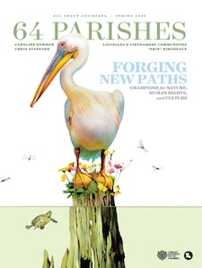

## 📚 Selected Publications

For a full list, see my [Google Scholar profile](https://scholar.google.com/citations?user=8jtmeYUAAAAJ&hl=en).

---

<strong>🗞️ Articles</strong>

  
**[The ‘Ambroise Affair’...](https://drive.google.com/file/d/13HDaWQDQkAgnthVORFdYn4tqqhlsAguF/view?usp=sharing)**

  
**[Église, État, et Esclavage...](https://www.portail-esclavage-reunion.fr/documentaires/l-esclavage/leglise-et-lesclavage/eglise-etat-et-esclavage-les-familles-vendues-comme-biens-nationaux-a-lile-de-la-reunion-pendant-la-revolution-francaise/)**

  
**[Looking for “Petit Jean”...](https://64parishes.org/looking-for-petit-jean)**

---

<strong>📘 Book Chapters</strong>

  
**[Gender, Family, and Social Control...](https://drive.google.com/file/d/1wrS2phtMkgjha5g6sPnsUbgIQzGT8S3Z/view?usp=sharing)**

  
**[‘Free and Naturalized Frenchwomen’...](https://drive.google.com/file/d/1ro_OSNdbyXvhlbsgDIOxa0Bu_vPYurnD/view?usp=sharing)**

  
**[‘A Thousand Prejudices’...](https://drive.google.com/file/d/11tlLSyZsk0CGviQG3r8ItdsuyUudYvXS/view?usp=sharing)**

---

<strong>📑 Essays & Special Issues</strong>

  
**[Gender in Slave and Post-Emancipation...](https://doi.org/10.4000/11oa3)**

  
**[France and its Empire in the Indian Ocean...](https://drive.google.com/file/d/1E-aXR8FHurDIJGhWrcERDPEunQA0EhkR/view?usp=sharing)**

  
**[Instructions du Ministère de la Marine...](https://www.cairn.info/revue-outre-mers-2015-2-page-285.htm)**

