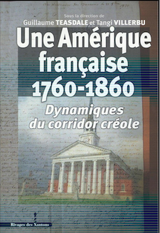

[GoogleScholar Page](https://scholar.google.com/citations?user=8jtmeYUAAAAJ&hl=en)

## Publications

### Special Issue

**Link:** [Gender in Slave and Post-Emancipation Societies](https://doi.org/10.4000/11oa3)  

---

### Online Article

**Link:** [Église, État, et Esclavage : Les familles vendues comme « biens nationaux » à l’île de La Réunion pendant la Révolution française](https://www.portail-esclavage-reunion.fr/documentaires/l-esclavage/leglise-et-lesclavage/eglise-etat-et-esclavage-les-familles-vendues-comme-biens-nationaux-a-lile-de-la-reunion-pendant-la-revolution-francaise/)  

---

### Magazine Article

**Link:** [Looking for “Petit Jean”: Legacies of French-Colonial Louisiana in Arkansas](https://64parishes.org/looking-for-petit-jean)  

---
### Book Chapter

**Link:** [Gender, Family, and Social Control: The Catholic Clergy and Slavery in the Eighteenth-Century Mascarenes](https://drive.google.com/file/d/1wrS2phtMkgjha5g6sPnsUbgIQzGT8S3Z/view?usp=sharing)

---

### Book Chapter

**Link:** [‘Free and Naturalized Frenchwomen’: Gender and the Politics of Race on Revolution-Era Bourbon Island](https://drive.google.com/file/d/1ro_OSNdbyXvhlbsgDIOxa0Bu_vPYurnD/view?usp=sharing)

---

### Bibliographical Essay

**Link:** [France and its Empire in the Indian Ocean](https://drive.google.com/file/d/1E-aXR8FHurDIJGhWrcERDPEunQA0EhkR/view?usp=sharing)

---

### Journal Article

**Link:** [The ‘Ambroise Affair’: White Women, Black Men, and the Limits of Métissage in Revolution-Era Réunion](https://drive.google.com/file/d/13HDaWQDQkAgnthVORFdYn4tqqhlsAguF/view?usp=sharing)

---

### Document Essay

**Link:** [Instructions du Ministère de la Marine, concernant la tolérance envers l’islam et l’hindouisme dans les colonies françaises de l’Océan indien sous l’Ancien Régime](https://www.cairn.info/revue-outre-mers-2015-2-page-285.htm)

---

### Book Chapter

**Link:** [‘A Thousand Prejudices’: French Habitants and Catholic Missionaries in the Making of the Old Northwest, 1795-1805](https://drive.google.com/file/d/11tlLSyZsk0CGviQG3r8ItdsuyUudYvXS/view?usp=sharing)
